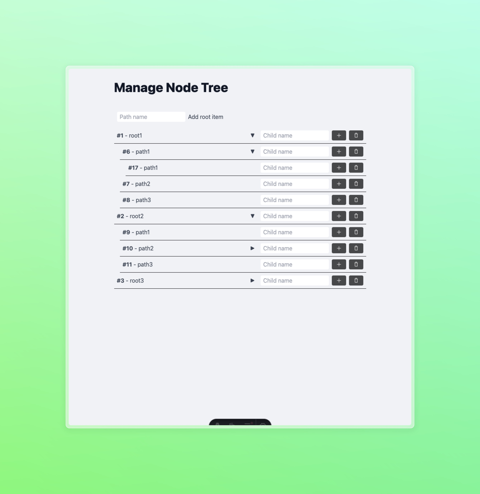
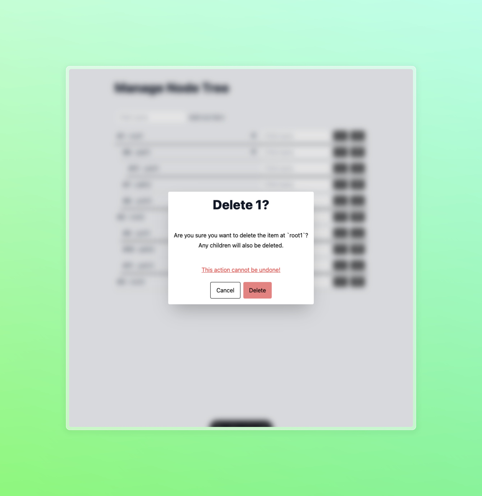

# Lexter.ai challenge

> As instruções para o desafio proposto estão no arquivo [`challenge-instructions.md`](./challenge-instructions.md)

## Screenshots

### Tela principal

### Tela de exclusão

## Escolha de tecnologias

### Stack
- [Typescript](https://typescriptlang.org)
- [Bun](https://bun.sh)
- [Astro](https://astro.build)
- [Tailwind](https://tailwindcss.com)
- [Solid.js](https://solidjs.com)
- [Biome.js](https://biomejs.dev)
- [Zod](https://zod.dev)
- [Vitest](https://vitest.dev)

### Intenção

A intenção com essa stack é a de fornecer uma visão de projeto simples onde os arquivos podem se manter mínimos em LOC e ainda assim fornecer uma experiência de desenvolvimento agradável e performática devido ao meu timebox.

Devido à natureza aberta do desafio trabalhei para manter o foco na solução principal e implementações mínimas ao redor das tecnologias que escolhi, mantendo o código o mais simples possível e evitando o uso de muitas bibliotecas e dependências.

### Razões

Typescript é a linguagem que domino melhor e também foi proposta pelo desafio.

Bun é um bundler e package manager que fornece uma velocidade de feedback alta e uma experiência de desenvolvimento superior ao npm.

Astro é um framework que permite a criação de sites estáticos com componentes reutilizáveis e uma sintaxe familiar para quem já trabalhou com React, com sua última release dá suporte à actions que permite uma implementação similar ao que vem sendo implementado pelos times do React e Next.js.
É um framework que tenho explorado recentemente em projetos menores sempre que possível e tenho gostado bastante da experiência.

Tailwind é um framework de CSS que permite a criação de componentes reutilizáveis e uma estilização mais rápida e consistente. Utilizo em todos projetos que trabalho atualmente e têm se provado uma ótima ferramenta para todos os níveis de projeto.

Solid.js é um framework de front-end que tem como objetivo ser uma alternativa ao React, com uma API mais simples e performática. É um framework que tenho acompanhado desde seu lançamento e tenho gostado bastante da proposta e da comunidade que está se formando em torno dele.

Biome.js é um linter mais enxuto e rápido que o Prettier e é minha preferência e recomendação para a maioria dos projetos por possuir menor overhead de configuração.

Zod é uma biblioteca de validação de dados que possui uma boa adoção e grande integração em projetos Typescript.
Seus tipos são inferidos pelo compilador e é possível compartilhar os mesmos tipos entre frontend e backend.

Vitest é um test runner para a execução de testes em projetos Typescript com uma configuração mínima e uma experiência de desenvolvimento melhor e mais rápida comparado ao Jest.

## Arquitetura

A principal lógica para resolução do desafio está no arquivo `src/actions/transform.ts` que é responsável por receber o texto e transformá-lo em um array de objetos no formato `Output` como proposto pelo desafio.

Para integração ao framework Astro transferi os tipos estáticos para modelos do Zod localizados em `src/models`.

Para representar o cliente utilizei submissão de formulários ao invés de requisições HTTP na intenção de ter uma experiência que pode ser melhorada progressivamente se adaptando à casos mais extremos de conexão do usuário.

Combinando tailwind com componentes Solid.js que são renderizados via SSR é possível entregar uma experiência de carregamento mais rápida sem deixar de lado a interatividade da interface.

Para os componentes fiz uso de componentes nativos do navegador como `dialog` para modais de confirmação e `details` para o componente que compõe a árvore de dados.

## Testes

Basta rodar `bun test` para executar os testes unitários.

## Como rodar o projeto

O projeto foi desenvolvido utilizando o [Bun](https://bun.sh) e recomendo utilizá-lo pela performance mas suas dependências permanecem compatíveis com node.js, então é possível instalar as dependências com qualquer package manager e rodar o projeto com qualquer runtime compatível com node.js que preferir.

Para o ambiente de desenvolvimento basta rodar o comando `bun dev` e acessar o endereço `http://localhost:4321` no navegador.

Este projeto está sendo publicado via Vercel e pode ser acessado em [lexter-challenge.guima.dev](https://lexter-challenge.guima.dev).

Com o adaptador `@astrojs/vercel` ainda não é possível utilizar `astro preview` para visualizar o build de produção localmente, mas é possível utilizar o [cli da vercel](https://vercel.com/docs/cli) parafazer um rápido deploy da aplicação em sua conta de preferência.

## Possibilidades adicionais

Para esse projeto seria possível em implementar a camada de persistência com [Turso](https://turso.dev) e [Drizzle](https://orm.drizzle.team) para uma integração sólida com Typescript.
Ainda poderei dedicar mais um tempo à isso em breve, após receber o feedback da avaliação já que foi interessante trabalhar nele.

Turso é um banco de dados libSQL (fork do SQLite) que provê a escalabilidade de bancos mais tradicionais e a simplicidade de um banco de dados em arquivo.
Drizzle é um ORM que provê uma API simples e performática para trabalhar com bancos de dados relacionais em Typescript.

Utilizar uma camada de persistência poderia limpar um pouco do código ao redor da lógica que manipula o objeto em memória trazendo uma natureza mais funcional para o código, confiando no banco de dados como fonte de verdade e apenas transformando o formato do dado para exibição. Além é claro de fornecer uma experiência mais consistente.
